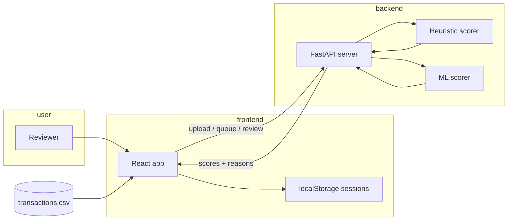

# Overview: what the backend does

## Purpose

Unfraudify helps a **human reviewer** work through suspicious card transactions efficiently. The backend does not replace the reviewer; it **prioritizes** which transactions deserve attention and **explains** why each one looks risky.

Think of it as a triage nurse: it does not diagnose every case, but it sorts patients so the doctor sees the urgent ones first and has notes on symptoms.

## Main responsibilities

1. **Ingest data** — Accept a CSV file of transactions (typically 1,000 rows for the challenge dataset).
2. **Score risk** — Assign each transaction a fraud score (0–1) and decide whether it should enter the review queue.
3. **Explain alerts** — Attach human-readable reasons (amount anomaly, new device, shared IP across cards, etc.).
4. **Support review** — Record reviewer decisions: approve, dismiss, escalate, or reset to pending.
5. **Export results** — Produce a CSV that combines original fields, scores, explanations, and review metadata.

## Two scoring engines

The same API can run **two different brains**. The frontend chooses which one via a query flag (`use_model`).

| Engine | When it runs | Needs a model file? | Best for |
|--------|----------------|---------------------|----------|
| **Heuristic** (default) | `use_model=false` | No | Challenge dataset, demos, conservative queue size |
| **Machine learning** | `use_model=true` | Yes (`algo/ops/fraud_model.pkl`) | When you have trained on labeled data and deployed the artifact |

Both engines return the **same shape** of data to the UI: fraud score, flag, reasons, baselines, cross-card metrics, and charts data.

### Heuristic engine (rules + weights)

Located in `fraud_scorer.py`. It compares each transaction to **that card’s past behavior** and to **patterns across all cards** (e.g. one device used on many cards). Scores are built from weighted risk components, not from a file learned on past fraud labels.

- Default flag threshold: **0.55** (tuned for ~1% fraud rate so the queue stays manageable).
- Designed to be **conservative**: fewer false alarms in the review queue matter more than catching every edge case when labels are unknown.

### ML engine (LightGBM + rules)

Located in `ml_fraud_scorer.py` and `algo/algo.py`. A **gradient boosted tree** model learns patterns from historical data where `is_fraud` is known (training CSV). Six **guardrail rules** always run in parallel so obvious fraud patterns are not missed if the model is uncertain.

- Combined score = model probability + a boost when any guardrail fires (capped at 1.0).
- A transaction is flagged if **either** the model exceeds its threshold **or** any guardrail triggers.

## What the backend does *not* do (today)

These are intentional limits for the challenge demo:

- **No permanent database** — Uploads and review decisions live in server memory until the process restarts.
- **No real-time card network** — It scores a batch CSV, not live authorization streams.
- **No automatic blocking** — It recommends review; it does not block cards or decline payments by itself.

## How it fits in the full app

The **React frontend** (`frontend/`) is a review workstation. It uploads CSVs, loads flagged transactions from this backend in pages, shows explainability detail on demand, and syncs approve/dismiss/escalate decisions back here. It does not run fraud logic locally.

Full frontend ↔ backend flow: [../../docs/architecture.md](../../docs/architecture.md)

Typical API sequence from the UI:

1. `POST /upload` — send the CSV
2. `GET /analysis/summary/{file_hash}` — counts and queue stats
3. `GET /analysis/queue/{file_hash}` — paginated flagged rows
4. `GET /analysis/transaction/{file_hash}/{id}` — full explainability when the reviewer opens a row
5. `POST /review/...` — record decisions
6. `GET /export/{file_hash}` — download enriched CSV (optional)

## Key files (conceptual map)

| Area | Main code | Role |
|------|-----------|------|
| HTTP API | `main.py` | Upload, analysis, review, export |
| Heuristic scoring | `fraud_scorer.py` | Default production scorer for challenge |
| ML scoring | `ml_fraud_scorer.py` | Loads trained pipeline, adapts output for API |
| ML training & features | `algo/algo.py` | Features, training, rules, SHAP, drift |
| Train script | `scripts/train_fraud_model.py` | Writes `fraud_model.pkl` |
| Hyperparameter search | `algo/tune_lgbm.py` | Optional Optuna tuning (offline) |
| Challenge export | `export_challenge_csv.py` | Offline CSV using heuristic scorer |

For the next level of detail, continue with [02-data-and-workflow.md](02-data-and-workflow.md).
