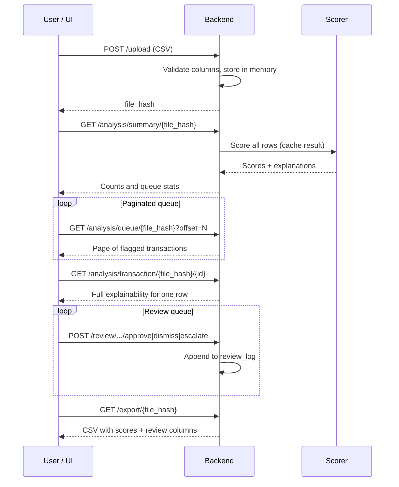

# Data and workflow

## Input: transaction CSV

Each row is one payment. The backend **requires** these columns:

| Column | Meaning | Example |
|--------|---------|---------|
| `transaction_id` | Unique ID for this payment | `tx_0042` |
| `timestamp` | When it happened (parseable date/time) | `2024-03-15 14:22:00` |
| `card_id` | Which card was used | `card_991` |
| `amount` | Payment amount | `127.50` |
| `merchant_name` | Where money was spent | `ACME STORE` |
| `merchant_category` | Type of business | `grocery`, `electronics` |
| `channel` | How the payment was made | `online`, `pos` |
| `cardholder_country` | Cardholder’s country | `US` |
| `merchant_country` | Merchant’s country | `US` |

**Optional** but valuable columns:

| Column | Meaning |
|--------|---------|
| `device_id` | Device fingerprint for online payments |
| `ip_address` | IP for online payments |

If optional columns are missing, the backend fills them with empty values so scoring still runs (with weaker device/IP signals).

Training data may include extra columns (`is_fraud`, `user_age`, `distance_to_merchant`, `city_pop`). Those are used only when training the ML model, not required for challenge uploads.

## Upload identity: file hash

When you upload a CSV, the server computes a **SHA-256 hash** of the file contents. That hash is the `file_hash` used in all later API calls.

- Same file uploaded twice → same hash, no duplicate storage.
- Different file → different hash, separate analysis and review log.

## End-to-end workflow



### Step 1 — Upload

The server parses the CSV, checks required columns, normalizes optional fields, and stores the table in memory keyed by `file_hash`.

### Step 2 — Analyze (on demand)

Analysis runs the first time you request summary, queue, or detail endpoints. Results are **cached** per `(file_hash, scoring mode)` so repeated requests are fast.

The live frontend typically calls:

- **`GET /analysis/summary/{file_hash}`** — total and flagged counts, review queue stats, whether ML is available
- **`GET /analysis/queue/{file_hash}`** — flagged rows sorted by score, with pagination (`limit`, `offset`) and optional `slim=true` for lighter list payloads
- **`GET /analysis/transaction/{file_hash}/{transaction_id}`** — full score breakdown and cross-card JSON when a reviewer opens one transaction

The bulk **`GET /analysis/all/{file_hash}`** endpoint still returns every row with explainability and is useful for scripts and integrations; the UI prefers paginated queue loading for performance.

Scoring modes:

- **Heuristic** — default.
- **ML** — add `?use_model=true` to analysis and export URLs (only if `fraud_model.pkl` exists).

Transactions are sorted by **time** before scoring so “history before this row” is meaningful.

### Step 3 — Review

Reviewers record decisions per `transaction_id`:

| Action | Meaning |
|--------|---------|
| **approve** | Treat as confirmed fraud (or accept the alert) |
| **dismiss** | False alarm; not fraud |
| **escalate** | Needs senior analyst or further investigation |
| **pending** | Clear a previous decision (back to untouched) |

Optional `reviewer_notes` free text is stored with each action.

### Step 4 — Export

Export merges:

- Original transaction columns
- Fraud columns (`is_fraud`, `fraud_score`, `fraud_reasons`, JSON explanation fields)
- Review columns (`review_decision`, `reviewer_notes`, `reviewed_at`)

Filename includes the first 8 characters of the hash for traceability.

## Output fields reviewers care about

| Field | Plain explanation |
|-------|-------------------|
| `is_fraud` | Should this appear in the review queue? (boolean) |
| `fraud_score` | Overall risk 0–1 |
| `fraud_reasons` | Short text summary of top reasons (semicolon-separated labels) |
| `score_breakdown` | JSON list of reasons with weights — powers the UI detail panel |
| `card_baseline_json` | JSON snapshot of “normal” for this card at this moment |
| `cross_card_signals_json` | JSON for shared device/IP and merchant burst metrics |
| `graph_features_json` | Numeric inputs for charts in the UI |
| `card_amount_series_json` | Recent amounts and scores on this card for sparklines |

When `use_model=true`, queue and export rows also include ML hybrid fields: `model_score`, `flagged_by_model`, `flagged_by_alert` (strict alert rule), and `rule_guardrail` (soft rule score boost). See [05-machine-learning-model.md](05-machine-learning-model.md).

## Memory and persistence

| Stored in memory | Lost when server restarts? |
|------------------|----------------------------|
| Raw uploaded CSV | Yes |
| Computed analysis cache | Yes |
| Review log per file_hash | Yes |

For production, you would typically persist uploads and decisions in a database; that is listed as future work in the project README.

## Offline batch export (no server)

These commands do not require the API server. They differ from the live UI export, which uses a **single** scorer based on the `use_model` toggle.

| Command | Output | Logic |
|---------|--------|-------|
| `make export` | `analyzed_transactions.csv` | Runs **both** scorers, then flags a row if an ML alert signal fires **or** heuristic `fraud_score ≥ 0.55`. Adds columns such as `heuristic_fraud_score`, `hybrid_decision_reason`, and `model_threshold`. |
| `make export-ml` | `ml_analyzed_transactions.csv` | **ML hybrid only** (model ≥ threshold or `rule_alert`). Requires `algo/ops/fraud_model.pkl`. |
| `make score-ml` | *(stdout only)* | Same ML scoring as `export-ml`, prints flag counts and breakdown. |

```bash
make export
```

That script reads `transactions.csv`, merges heuristic and ML outputs via `export_challenge_csv.py`, and writes empty review columns. It is the committed challenge output format.

Live session export: `GET /export/{file_hash}?use_model=false|true` — heuristic-only when `false`, **hybrid** (same as `make export`) when `true`, plus any review decisions recorded in that session.
