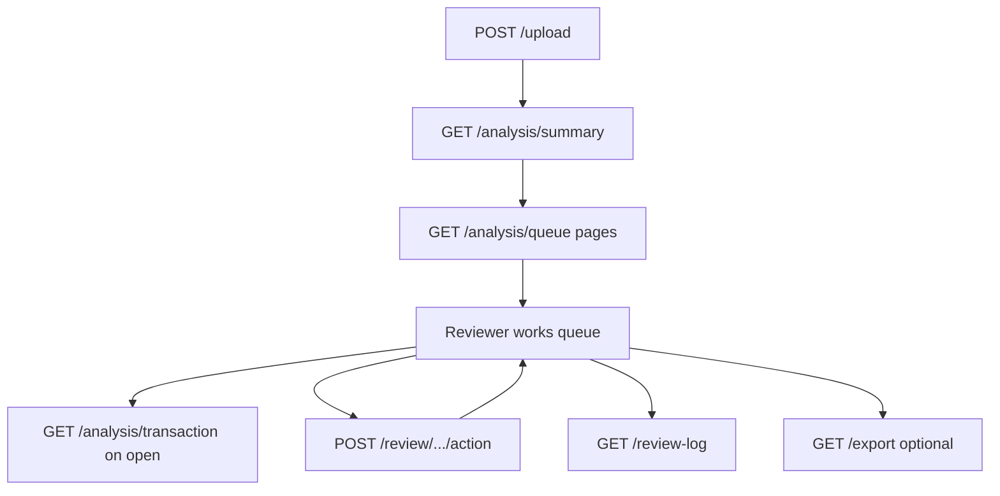

# API guide (for humans)

The backend is a **REST API** built with FastAPI. “REST” here simply means: the frontend calls specific URLs with standard actions (GET = read, POST = write).

Base URL in development: `http://127.0.0.1:8000`

Interactive docs (for developers): `http://127.0.0.1:8000/docs`

## Health and configuration

### `GET /`

**Purpose:** Check that the server is running.

**Response:** `{ "status": "ok" }`

### `GET /scoring/status`

**Purpose:** See which scoring engines are available.

**Response example:**

```json
{
  "heuristic": true,
  "ml_model_path": ".../algo/ops/fraud_model.pkl",
  "ml_model_available": true
}
```

- `heuristic` is always available.
- `ml_model_available` is `false` until you train and save `fraud_model.pkl`.

## File upload

### `POST /upload`

**Purpose:** Send a transaction CSV and receive an ID for all follow-up calls.

**Input:** Multipart file upload (the CSV binary).

**Success response:**

```json
{
  "file_hash": "abc123...",
  "message": "File uploaded successfully"
}
```

**Common errors:**

| HTTP code | Meaning |
|-----------|---------|
| 400 | CSV invalid, missing required columns, or bad timestamps |
| (duplicate) | Same file already uploaded — returns existing hash |

**Required CSV columns:** See [02-data-and-workflow.md](02-data-and-workflow.md).

## Analysis (read scored transactions)

All analysis endpoints accept optional query parameter:

- `use_model=false` (default) — heuristic scorer
- `use_model=true` — ML scorer (503 error if model file missing)

### `GET /analysis/summary/{file_hash}`

**Purpose:** High-level counts for dashboards and the upload confirmation screen.

**Returns:**

- `total_transactions` — rows in the uploaded CSV
- `flagged_count` — heuristic flags (includes rows with score > 0 even if below the hard flag threshold)
- `model_flagged_count` — same for ML scorer when available
- `ml_model_available` — whether `fraud_model.pkl` exists
- `flagged_queue_stats` / `model_flagged_queue_stats` — pending, approved, dismissed, escalated counts among flagged rows
- `model_threshold` — ML probability cutoff from the saved model (when ML is available)
- `model_only_count` — queued because model probability ≥ threshold, with no alert rule
- `alert_only_count` — queued because an alert rule fired, with model below threshold
- `model_alert_both_count` — queued because both model and an alert rule fired
- `soft_rule_only_count` — soft guardrail bumped `fraud_score` but row is **not** in the queue

The ML breakdown counts apply to hybrid scoring (`use_model=true`). The frontend uses them for the queue header and **Model only / Alert rule only / Model + alert** filter tabs.

This is usually the **first** call after upload.

### `GET /analysis/queue/{file_hash}`

**Purpose:** Paginated review queue — the primary endpoint used by the live frontend.

**Query parameters:**

| Parameter | Default | Meaning |
|-----------|---------|---------|
| `use_model` | `false` | ML vs heuristic scorer |
| `flagged_only` | `true` | When `false`, include non-flagged rows |
| `limit` | all remaining | Page size |
| `offset` | `0` | Skip N rows (sorted by fraud score descending) |
| `slim` | `false` | Omit heavy `card_baseline` JSON on list items |
| `transaction_id` | — | Return one specific row |

**Returns:** `{ items, total, offset, limit }` where each item includes transaction fields, fraud score, reasons, and review decision columns.

When `use_model=true`, each item also includes ML hybrid fields (omitted for heuristic mode):

| Field | Meaning |
|-------|---------|
| `model_score` | LightGBM fraud probability (0–1) |
| `flagged_by_model` | Model probability ≥ saved threshold |
| `flagged_by_alert` | A strict alert guardrail fired (`rule_alert` in training code) |
| `rule_guardrail` | A soft guardrail fired (score boost only; does not queue by itself) |

The frontend maps these to queue-cause filters: model-only, alert-only, or both.

### `GET /analysis/transaction/{file_hash}/{transaction_id}`

**Purpose:** Full explainability for a single transaction when the reviewer opens the detail panel.

**Returns:** Transaction fields plus:

- `heuristic` — score, reasons, `score_breakdown`, `card_baseline`, `cross_card_signals`, `graph_features`
- `model` — same shape when ML artifact is available (otherwise omitted)
- Current `review_decision`, `reviewer_notes`, `reviewed_at`

### `GET /analysis/related/{file_hash}/{transaction_id}`

**Purpose:** Other transactions on the same card, or sharing the same device or IP — for cross-card investigation panels.

**Query:** `use_model` as above.

**Returns:** `{ items: [...] }` sorted by timestamp.

### `GET /analysis/all/{file_hash}`

**Purpose:** Full scored dataset in one response — useful for scripts, exports, and integrations. The live UI prefers `/analysis/queue` with pagination for large files.

**Returns:** A list of rich objects per transaction, including:

- Core fields (id, time, card, amount, merchant, channel, countries)
- `is_fraud`, `fraud_score`
- `reasons` — short labels derived from the score breakdown
- `score_breakdown` — detailed weighted reasons
- `card_baseline`, `cross_card_signals`, `graph_features`, `card_amount_series`

### `GET /analysis/user/{file_hash}/{card_id}`

**Purpose:** All transactions for one card, in time order — for “card history” panels.

**Note:** Scoring still used the **full file** (cross-card signals stay correct); this endpoint only **filters** the result.

### `GET /analysis/ip/{file_hash}/{ip_address}`

**Purpose:** All transactions sharing an IP — useful when investigating account takeover rings.

## Review actions

### `POST /review/{file_hash}/{transaction_id}/{action}`

**Purpose:** Record what the reviewer decided.

**URL `action`:** one of `approve`, `dismiss`, `escalate`, `pending`

**JSON body (must match URL action):**

```json
{
  "action": "dismiss",
  "reviewer_notes": "Customer confirmed purchase by phone"
}
```

**Success response:** Confirmation with `reviewed_at` timestamp (UTC).

**Errors:**

| Code | Cause |
|------|-------|
| 404 | Unknown file_hash or transaction_id |
| 400 | Invalid action or body mismatch |

### `GET /review/{file_hash}/audit`

**Purpose:** Chronological audit trail of review actions for this upload (newest first).

### `GET /review-log/{file_hash}`

**Purpose:** Same underlying data as audit, shaped as a review log list (also sorted by time).

## Export

### `GET /export/{file_hash}`

**Purpose:** Download one CSV with transactions, fraud columns, and review columns.

**Query:** `use_model` as above.

**Response:** File download (`analyzed_transactions_<hash-prefix>.csv`).

## Typical frontend sequence



Legacy integrations may still call `GET /analysis/all` instead of paginated queue endpoints.

## Error handling philosophy

The API returns **clear HTTP status codes** instead of silent failures:

- **404** — You referenced a file or transaction that was never uploaded.
- **400** — The CSV or review request is malformed.
- **503** — ML scoring requested but the model artifact is not on disk.

This helps the UI show actionable messages (“train the model first” vs “file not found”).
