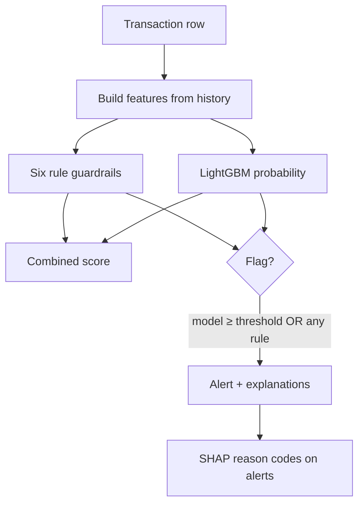

# Machine learning model

The ML path adds a **learned** component on top of the same feature philosophy as the heuristic system. Code lives mainly in `algo/algo.py` (training) and `ml_fraud_scorer.py` (serving through the API).

## What model is used?

**LightGBM** — a gradient boosted decision tree classifier.

In simple terms: the computer builds thousands of small “if amount > X and country changed, then slightly more suspicious” decisions, learned from past examples where we know if fraud occurred (`is_fraud = 1` or `0`).

Why trees?

- Handle mixed data (numbers + categories like country).
- Work well with **imbalanced** data (few frauds, many legit rows).
- Train relatively quickly on hundreds of thousands of rows.

## Hybrid scoring: model + guardrails

Production ML scoring is intentionally **not** model-only.

### Model probability

The model outputs a number between 0 and 1: estimated chance of fraud given features.

### Rule boost

If **any** of six guardrails fires, the combined score gets up to **+0.35** (capped at 1.0). That pulls borderline model scores into the alert zone when rules see obvious abuse.

### Flag rule

Alert if:

- Model probability ≥ **threshold** (saved in the model file, chosen during training), **OR**
- Any guardrail is true.

## The six guardrails (plain English)

| Rule | Fires when |
|------|------------|
| **Amount** | Spend is far above this card’s norm (≥ 3σ) or above this **category** norm (≥ 3.5σ) |
| **Velocity** | Many transactions in 5 minutes (≥ 4) or 1 hour (≥ 8) on the same card |
| **Geo** | Cross-border payment **and** country changed vs previous transaction or fast hop (< 1 hour) |
| **Off-hours** | Unusual hour for this card **and** elevated amount |
| **Device / IP** | Same device or IP seen on ≥ 3 different cards in 24 hours |
| **Merchant burst** | Merchant name changed **and** ≥ 3 transactions in the last hour |

Guardrails catch **known attack shapes** even when the ML model is uncertain on new fraud types.

## Features the model sees

Features are engineered so each row only uses **information available at that moment in time** (no peeking at future transactions — avoids “cheating” in evaluation).

Categories include:

| Group | Examples |
|-------|----------|
| **Time** | Hour, weekend, night |
| **Amount shape** | Log amount, round amounts, just-below-$100 patterns |
| **Velocity** | Counts in 1 min / 5 min / 1 h / 24 h; spend in 24 h |
| **Changes** | New merchant, device, country hop, cross-border |
| **Cross-card** | Distinct cards per device/IP in 24 h |
| **Card history** | Running mean/std, z-score vs card |
| **Category history** | Z-score vs merchant category |
| **Diversity** | Distinct categories in 24 h |
| **Hour pattern** | Rare or never-seen hour for this card |
| **Missing flags** | No device / no IP (often normal for in-store) |

Categorical columns (merchant category, channel, countries) are fed to LightGBM as **categories**, not arbitrary numbers.

Challenge CSVs may lack `user_age`, `distance_to_merchant`, `city_pop`; at inference those are filled with empty values so the matrix shape still matches training.

Full list: `FEATURES` in `algo/algo.py`.

## Explainability (SHAP)

For transactions flagged by the model, the system uses **SHAP** (SHapley Additive exPlanations) to list which features pushed the score up.

Those become short **reason codes** in analyst language, e.g.:

- “amount 4σ above card norm”
- “9 cards on this IP”
- “atypical hour for card (03:00)”

Rule hits add separate **rule reason codes**. The final `alert_reason` merges rules and SHAP text, e.g. `flagged: amount 6σ above card norm + 9 cards on this IP`.

This supports trust and audit: reviewers see *why*, not only a probability.

## Model artifact

After training, the pipeline saves `algo/ops/fraud_model.pkl` containing:

| Content | Purpose |
|---------|---------|
| Trained LightGBM model | Scoring |
| `threshold` | Cutoff chosen on validation data |
| `features` | Column list for consistency |
| `version` | Format version |

The API loads this file once and caches it in memory when `use_model=true`.

## Serving path (`ml_fraud_scorer.py`)

1. Normalize upload CSV (timestamps, optional columns).
2. Load pipeline from disk (SHAP explainer built on first use).
3. Build features + guardrails (same as training).
4. Predict probabilities and hybrid flags.
5. For **flagged** rows, build `score_breakdown` from **SHAP** (readable labels like “Amount is 3.2× typical spend”) plus rule guardrail lines when fired.
6. Fall back to heuristic breakdown only if SHAP returns nothing; keep heuristic `card_baseline` / cross-card JSON for context charts.
7. Map output columns to the same JSON shape the heuristic scorer uses so the **frontend does not change**.

## Drift monitoring (operations concept)

`DriftMonitor` in `algo/algo.py` tracks **weekly PR-AUC** (a quality metric for rare fraud) in `algo/ops/drift_metrics.json`.

- If performance drops sharply vs baseline → recommend retrain.
- If no retrain for 4 weeks → scheduled retrain suggestion.

This is aimed at production ops, not the challenge demo API.

## When to use ML vs heuristic

| Choose heuristic | Choose ML |
|------------------|-----------|
| No labeled training data | You have `is_fraud` labels and retrain regularly |
| Want fixed, auditable weights | Want patterns learned from data |
| Challenge / demo default | Higher recall potential with proper validation |

Training steps: [06-training-and-tuning.md](06-training-and-tuning.md).
