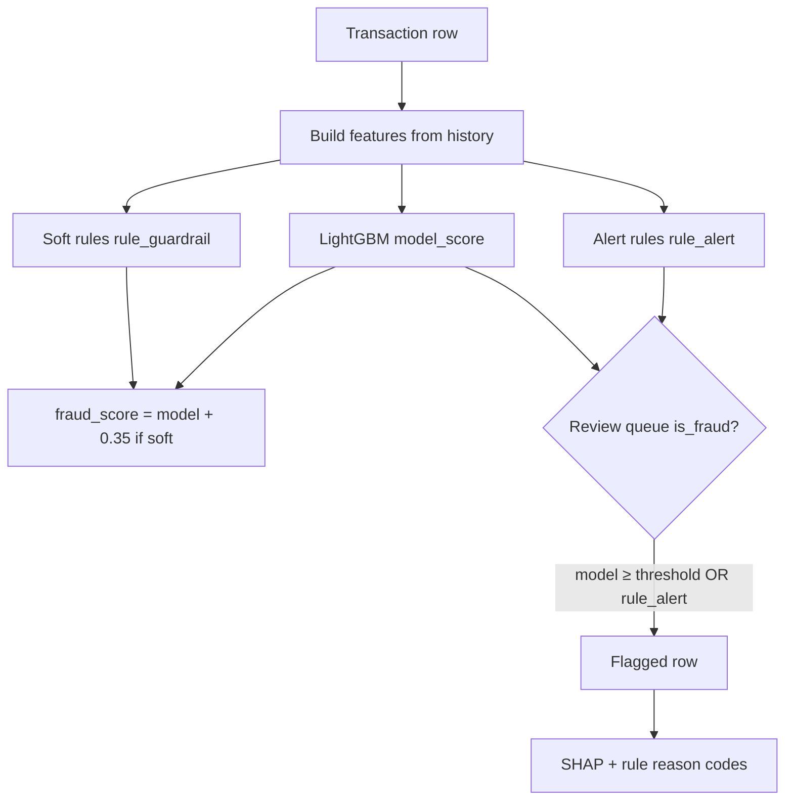

# Machine learning model

The ML path adds a **learned** component on top of the same feature philosophy as the heuristic system. Code lives mainly in `algo/algo.py` (training) and `ml_fraud_scorer.py` (serving through the API).

## What model is used?

**LightGBM** — a gradient boosted decision tree classifier.

In simple terms: the computer builds thousands of small “if amount > X and country changed, then slightly more suspicious” decisions, learned from past examples where we know if fraud occurred (`is_fraud = 1` or `0`).

Why trees?

- Handle mixed data (numbers + categories like country).
- Work well with **imbalanced** data (few frauds, many legit rows).
- Train relatively quickly on hundreds of thousands of rows.

## Hybrid scoring: model + guardrails

Production ML scoring is intentionally **not** model-only.



### Model probability

The model outputs a number between 0 and 1: estimated chance of fraud given features.

### Rule boost

If **any** of six guardrails fires, the combined score gets up to **+0.35** (capped at 1.0). That pulls borderline model scores into the alert zone when rules see obvious abuse.

### Flag rule

Alert if:

- Model probability ≥ **threshold** (saved in the model file, chosen during training), **OR**
- A **high-confidence guardrail** fires (`rule_alert` — strict amount, velocity, geo, cross-card burst).

Softer guardrail hits still add up to **+0.35** to the combined score (`rule_guardrail`) so borderline model scores can surface, without every soft signal auto-queuing a review (which was over-flagging ~30% on the challenge CSV).

## The six guardrails (plain English)

Each family has a **soft** bar (`rule_guardrail`, bumps `fraud_score`) and a **stricter alert** bar (`rule_alert`, can queue without a high model score). See [Guardrail design & limitations](#guardrail-design--limitations) for why there are two tiers and where thresholds come from.

| Rule | Soft (`rule_guardrail`) | Alert (`rule_alert`) |
|------|-------------------------|----------------------|
| **Amount** | z vs card ≥ 3.0 or z vs category ≥ 3.5 | z vs card ≥ 4.5 or z vs category ≥ 5.0 |
| **Velocity** | ≥ 4 tx / 5 min or ≥ 8 / 1 h | ≥ 5 / 5 min or ≥ 10 / 1 h (and soft velocity already true) |
| **Geo** | Cross-border **and** fast country hop (< 1 h) **and** corroboration | Same, **and** z vs card ≥ 3.0 |
| **Off-hours** | Hour never seen for card **and** elevated amount | *(no separate alert — use amount/velocity alerts)* |
| **Device / IP** | ≥ 3 distinct cards on device/IP in 24 h | IP fanout ≥ 4 |
| **Merchant burst** | ≥ 4 tx / 30 min at merchant **and** ≥ 3 cards / 2 h | ≥ 7 distinct cards / 2 h at merchant |

Guardrails catch **known attack shapes** even when the ML model is uncertain on new fraud types.

## Guardrail design & limitations

This section documents how the two-tier system works, where numeric cutoffs come from, and what is safe to claim when scoring unlabeled files like `transactions.csv`.

### Three outputs per row

| Output | Column | Meaning |
|--------|--------|---------|
| Model belief | `model_score` | LightGBM fraud probability (0–1) |
| Display / ranking score | `fraud_score` | `model_score` plus up to **+0.35** if any **soft** rule fired (capped at 1.0) |
| Review queue | `is_fraud` | Row appears in the analyst queue |

Queue admission today:

```text
is_fraud = (model_score ≥ threshold)  OR  rule_alert
```

Soft rules **do not** auto-queue by themselves. They increase `fraud_score` so the UI can rank “unusual but not extreme” rows; only the model or an **alert** rule adds them to the queue.

That mirrors the heuristic scorer: a **weighted score** built from many weak signals, plus a small set of **high-confidence overrides** (`high_confidence_rule` in `fraud_scorer.py`).

### Why two tiers exist

An earlier hybrid rule was `is_fraud = (model ≥ threshold) OR (any soft rule)`. On the challenge CSV (~1,000 rows, no labels) that queued **~31%** of rows. Most were not “model thinks fraud”; they were **routine anomalies** (especially cross-border spend plus a merchant-country change vs the card’s previous transaction).

The fix is architectural, not cosmetic:

1. **Soft tier** — statistically unusual or mildly suspicious (3σ spend, shared IP on 3 cards, etc.). Appropriate for **score boost**, not automatic escalation.
2. **Alert tier** — patterns aligned with **known attack shapes** and the heuristic’s high-confidence overrides (extreme amount tails, IP fanout ≥ 4, merchant burst ≥ 7 cards, etc.). Appropriate for **queue without relying on the model**.

### Where the numbers come from

| Constant | Value | Origin |
|----------|-------|--------|
| **Model threshold** | ~0.19 (in `fraud_model.pkl`) | Validation split on **labeled** `fraudTrain_part1.csv`; minimizes expected cost with missed fraud = **50**, false alarm = **10** (`DEFAULT_COST_FN` / `DEFAULT_COST_FP` in `algo/algo.py`). **Not** tuned to hit ~7% on the challenge CSV. |
| **Rule boost** | +0.35 | Same order of magnitude as heuristic geo weight (`foreign_country × corroborated × 0.35`). Chosen so a soft hit plus a borderline model (~0.20) lands near the heuristic queue cutoff (~0.55). |
| **Soft amount** | 3.0σ / 3.5σ | Standard outlier cutoffs; used in docs and industry playbooks. Many legit rows still exceed 3σ because spend is heavy-tailed and tests are repeated across cards. |
| **Alert amount** | 4.5σ / 5.0σ | Stricter tail — “extreme” spend vs card/category. Same *family* as heuristic `amount_ratio ≥ 7` (different feature scale). |
| **Soft velocity** | 4 / 5 min, 8 / 1 h | Operational defaults for card-testing bursts. |
| **Alert velocity** | 5 / 5 min, 10 / 1 h | Stricter subset of soft velocity. |
| **Soft device/IP** | ≥ 3 cards / 24 h | “More than a household” on one instrument — worth scoring. |
| **Alert IP / merchant** | ≥ 4 cards, ≥ 7 cards / 2 h | Matches heuristic `high_confidence_rule` (IP fanout ≥ 4, merchant unique cards ≥ 7). |
| **Geo corroboration** | z ≥ 2.0 / 2.5 or novel device/IP/category | Copied from heuristic `corroborated` — cross-border **alone** must not queue. |

Implementation: `apply_rule_guardrails()` in `algo/algo.py`; serving: `ml_fraud_scorer._model_decisions()`.

### What is principled vs what was tuned on an unlabeled file

**Principled (design / labeled training):**

- Separating **score bump** from **auto-queue** so queue size reflects escalation policy, not “any anomaly.”
- Geo requires **cross-border + fast hop + corroboration**, not “US card at a Canadian merchant” on its own.
- Alert families mirror heuristic **high-confidence** patterns (extreme amount, cross-card IP, merchant fanout).
- Model threshold from **labeled** validation economics.

**Empirical (challenge CSV, no labels):**

- Exact alert cutoffs (e.g. 4.5σ vs 4.0σ, velocity 5 vs 4) were tightened so `rule_alert` fires on the order of **tens** of rows on `transactions.csv`, not hundreds — while keeping the same pattern families.

**Do not infer detection quality from queue rate:**

- ~7% of the challenge file is **hidden true fraud** (~70 rows).
- ~6% **flagged** by ML hybrid (~63 rows) after the two-tier fix is **not** proof those rows are fraud.
- Similar flag counts between heuristic (~61) and ML hybrid (~63) only means both engines were tuned for a **focused queue**, not that either matches the answer key.

Proper evaluation requires **labeled** holdout data (training test split or production outcomes): precision, recall, F1, and cost at the chosen threshold. Use `make score-ml` for operational counts; use training evaluation in [06-training-and-tuning.md](06-training-and-tuning.md) for quality.

### Limitations and next steps

- **Soft rules no longer gate the queue** — only `model_score` and `rule_alert` do. The +0.35 boost does not currently re-open the queue via a combined-score cutoff (e.g. `fraud_score ≥ 0.55`). Adding that would let borderline model scores surface when a soft rule fires, without returning to `OR any soft rule`.
- **Alert thresholds should be re-tuned on labeled validation**, not on `transactions.csv`, before claiming production-ready precision/recall.
- **Retrain or recalibrate** when fraud patterns or economics (`cost_fn` / `cost_fp`) change; drift monitoring is described under [Drift monitoring](#drift-monitoring-operations-concept) below.

## Features the model sees

Features are engineered so each row only uses **information available at that moment in time** (no peeking at future transactions — avoids “cheating” in evaluation).

Categories include:

| Group | Examples |
|-------|----------|
| **Time** | Hour, weekend, night |
| **Amount shape** | Log amount, round amounts, just-below-$100 patterns |
| **Velocity** | Counts in 1 min / 5 min / 1 h / 24 h; spend in 24 h |
| **Changes** | New merchant, device, country hop, cross-border |
| **Cross-card** | Distinct cards per device/IP in 24 h; merchant transaction bursts and unique cards |
| **Card history** | Running mean/std, z-score vs card |
| **Category history** | Z-score vs merchant category |
| **Diversity** | Distinct categories in 24 h |
| **Hour pattern** | Rare or never-seen hour for this card |
| **Missing flags** | No device / no IP (often normal for in-store) |

Categorical columns (merchant category, channel, countries) are fed to LightGBM as **categories**, not arbitrary numbers.

Challenge CSVs may lack `user_age`, `distance_to_merchant`, `city_pop`; at inference those are filled with empty values so the matrix shape still matches training.

Full list: `FEATURES` in `algo/algo.py`.

## Explainability (SHAP)

For transactions flagged by the model, the system uses **SHAP** (SHapley Additive exPlanations) to list which features pushed the score up.

Those become short **reason codes** in analyst language, e.g.:

- “amount 4σ above card norm”
- “9 cards on this IP”
- “atypical hour for card (03:00)”

Rule hits add separate **rule reason codes**. The final `alert_reason` merges rules and SHAP text, e.g. `flagged: amount 6σ above card norm + 9 cards on this IP`.

This supports trust and audit: reviewers see *why*, not only a probability.

## Model artifact

After training, the pipeline saves `algo/ops/fraud_model.pkl` containing:

| Content | Purpose |
|---------|---------|
| Trained LightGBM model | Scoring |
| `threshold` | Cutoff chosen on validation data |
| `features` | Column list for consistency |
| `version` | Format version |

The API loads this file once and caches it in memory when `use_model=true`.

## Serving path (`ml_fraud_scorer.py`)

1. Normalize upload CSV (timestamps, optional columns).
2. Load pipeline from disk (SHAP explainer built on first use).
3. Build features + guardrails (same as training).
4. Predict probabilities and hybrid flags.
5. For **flagged** rows, build `score_breakdown` from **SHAP** (readable labels like “Amount is 3.2× typical spend”) plus rule guardrail lines when fired.
6. Fall back to heuristic breakdown only if SHAP returns nothing; keep heuristic `card_baseline` / cross-card JSON for context charts.
7. Map output columns to the same JSON shape the heuristic scorer uses so the **frontend does not change**.

## Drift monitoring (operations concept)

`DriftMonitor` in `algo/algo.py` tracks **weekly PR-AUC** (a quality metric for rare fraud) in `algo/ops/drift_metrics.json`.

- If performance drops sharply vs baseline → recommend retrain.
- If no retrain for 4 weeks → scheduled retrain suggestion.

This is aimed at production ops, not the challenge demo API.

## When to use ML vs heuristic

| Choose heuristic | Choose ML |
|------------------|-----------|
| No labeled training data | You have `is_fraud` labels and retrain regularly |
| Want fixed, auditable weights | Want patterns learned from data |
| Challenge / demo default | Higher recall potential with proper validation |

Training steps: [06-training-and-tuning.md](06-training-and-tuning.md).
