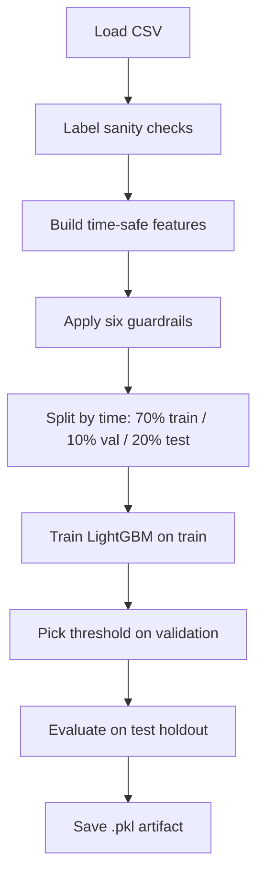

# Training and tuning the ML model

This guide explains how the LightGBM model is built, how we measure success, and how to improve settings — without requiring you to read Python.

## What you need to train

| Requirement | Why |
|-------------|-----|
| Labeled CSV | Each row needs `is_fraud` (0 = legit, 1 = fraud) |
| Timestamps | Rows sorted in time for fair evaluation |
| Enough history | Default training file: `fraudTrain_part1.csv` (~130k rows) |

The challenge upload file (`transactions.csv`) is **unlabeled** — you use it for review demos, not for training.

## One-command training

From the `backend` folder:

```bash
uv sync
uv run python -m scripts.train_fraud_model
```

Optional custom CSV:

```bash
uv run python -m scripts.train_fraud_model path/to/labeled_data.csv
```

**Output:** `algo/ops/fraud_model.pkl`

After this, `GET /scoring/status` should report `ml_model_available: true`.

## What happens during training (step by step)



### 1. Load and validate labels

The pipeline prints statistics comparing fraud vs legit on raw columns like `distance_to_merchant`. If fraud and legit are **trivially separable** on raw fields alone, offline metrics may look “too good” and not reflect real-world difficulty.

### 2. Feature engineering

See [05-machine-learning-model.md](05-machine-learning-model.md). Every feature respects **causality**: only past and current row information.

### 3. Temporal split (not random shuffle)

Data is split by **time quantiles**:

| Split | Share | Role |
|-------|-------|------|
| Train | 70% | Oldest segment — fit the model |
| Validation | 10% | Middle — choose alert threshold |
| Test | 20% | Newest — final unbiased metrics |

Random shuffling would leak “future” patterns into training and inflate scores. Fraud detection must be evaluated **as if predicting the future**.

### 4. Train LightGBM

Default hyperparameters live in `algo/lgbm_params.py` (tree depth, learning rate, sampling, etc.).

**Class imbalance:** Fraud rows are rare. Training uses `scale_pos_weight` ≈ (number of legit) ÷ (number of fraud) so the model does not ignore fraud.

### 5. Choose alert threshold

On the **validation** set, the system scores every possible cutoff and estimates:

- Precision (of flagged rows, how many are actually fraud)
- Recall (of all fraud, how many we caught)
- False positives and false negatives
- **Expected cost** = (missed fraud × cost_fn) + (false alarms × cost_fp)

Default economics in code:

- Missing one fraud costs **50** units (`cost_fn`)
- One false alarm costs **10** units (`cost_fp`)

The threshold with **lowest expected cost** on validation is saved into the model file. You can override later if your business prefers fewer false alarms.

### 6. Test evaluation

The **test** set is never used to pick the threshold. Metrics reported there include:

| Metric | Plain meaning |
|--------|----------------|
| **PR-AUC** | Overall ranking quality when fraud is rare (primary) |
| **ROC-AUC** | Ranking quality across all cutoffs |
| **Precision@K** | If reviewers only look at top K alerts per day, what fraction are fraud? |
| **Confusion matrix** | Counts of true/false positives and negatives at the chosen threshold |

Hybrid evaluation also runs: model + guardrails together, with sample alert reason text.

## Optional: hyperparameter tuning (Optuna)

Training uses sensible defaults. For better validation PR-AUC, you can run an **offline search** that tries many hyperparameter combinations:

```bash
cd backend
uv sync --extra tune
uv run --extra tune python -m algo.tune_lgbm fraudTrain_part1.csv --n-trials 40
```

**Outputs:**

| File | Content |
|------|---------|
| `algo/ops/best_lgbm_params.json` | Best settings + metadata |
| `algo/ops/optuna.db` | Search history (local, gitignored) |

Tuning does **not** automatically change production training. To use tuned params, integrate manually:

```python
from algo.lgbm_params import load_lgbm_params
from algo.algo import train_model
model = train_model(X_tr, y_tr, params=load_lgbm_params())
```

The standard `scripts/train_fraud_model.py` path uses defaults unless you extend it.

## Retraining and drift

`FraudDetectionPipeline.maybe_retrain()` checks `algo/ops/drift_metrics.json`:

- Retrain if weekly PR-AUC drops ≥ 0.05 vs baseline, or
- Retrain if ≥ 4 weeks since last retrain.

This is for operational workflows, not exposed as a public API endpoint today.

## Metrics cheat sheet for stakeholders

| If PR-AUC is… | Interpretation |
|---------------|----------------|
| High (~0.5+ on hard data) | Model ranks frauds above most legit rows |
| Low | Features or labels may be weak; or fraud is very hard to separate |

| If precision is low at your threshold | Too many false alarms — raise threshold or increase `cost_fp` in tuning |
| If recall is low | Missing fraud — lower threshold or increase `cost_fn` in tuning |

## Common pitfalls

1. **Training on shuffled data** — inflates metrics; always use time splits.
2. **Tuning threshold on test data** — cheats; threshold must come from validation only.
3. **Deploying without `fraud_model.pkl`** — ML API mode returns 503.
4. **Expecting ML on unlabeled challenge CSV** — upload scoring still works with heuristics only.

Next: [07-operations.md](07-operations.md) for day-to-day runbooks and file layout.
