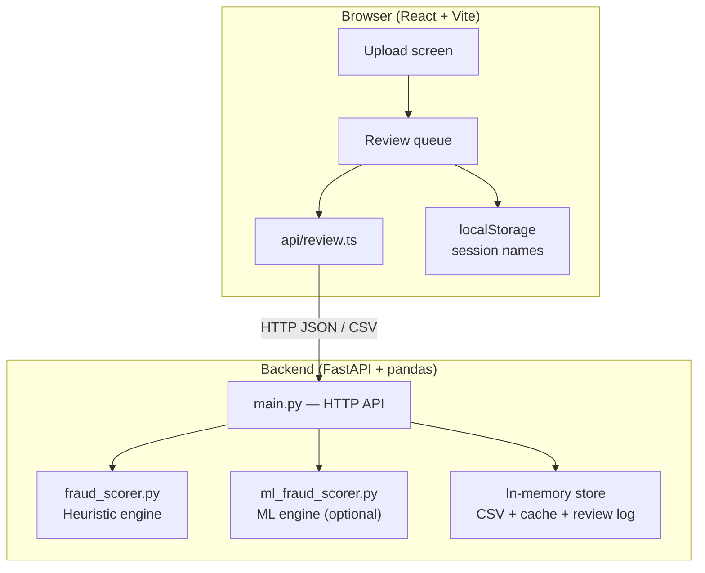
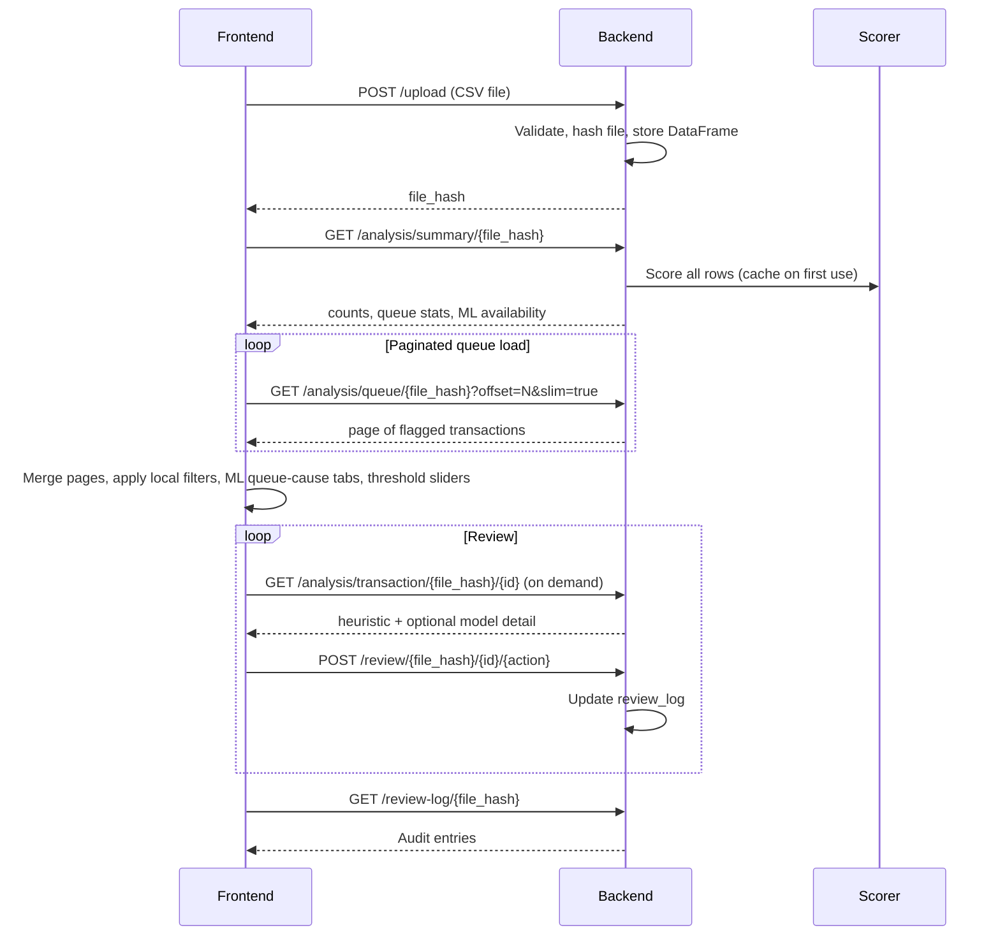

# Architecture — how Fraud Hunter works

This document explains how the **React frontend** and **FastAPI backend** fit together. It is written for new contributors and technical readers who want the big picture before diving into code.

## System overview

Fraud Hunter is a **client–server** app:

| Layer | Technology | Responsibility |
|-------|------------|----------------|
| Frontend | React, Vite, TanStack Query | Upload UI, review queue, keyboard workflow, threshold tuning |
| Backend | FastAPI, pandas | CSV ingest, fraud scoring, review persistence (in memory), export |
| Communication | REST over HTTP | JSON responses; CSV upload as multipart form data |

In development, the Vite dev server **proxies** `/api/*` to `http://127.0.0.1:8000`, so the frontend calls `/api/upload` and the proxy forwards to `/upload` on the backend.

## Design principle: detection stays on the server

The frontend **never** runs fraud logic. It:

- Uploads the CSV
- Fetches scores and explanations from the backend
- Displays them and syncs human decisions back

All feature engineering, baselines, cross-card signals, and model inference live in Python (`fraud_scorer.py`, `ml_fraud_scorer.py`, `algo/algo.py`).

## End-to-end data flow

### 1. Upload

- **Endpoint:** `POST /upload`
- **Input:** Multipart form with a `file` field
- **Output:** `{ file_hash, message }` — the hash is the session key for all later calls
- The server parses the CSV, validates required columns, and stores the table in `uploaded_files[file_hash]`

### 2. Summary

- **Endpoint:** `GET /analysis/summary/{file_hash}`
- Returns total row count, flagged counts for heuristic and (if available) ML scorers, review queue stats (pending / approved / dismissed / escalated), and ML queue-cause breakdown (`model_only_count`, `alert_only_count`, `model_alert_both_count`, `soft_rule_only_count`, `model_threshold`)
- Triggers scoring on first access; results are cached per `(file_hash, scoring_mode)`

### 3. Queue (paginated)

- **Endpoint:** `GET /analysis/queue/{file_hash}`
- Returns flagged transactions sorted by fraud score, with pagination (`limit`, `offset`)
- Query flags:
  - `use_model=true` — ML scorer instead of heuristic
  - `slim=true` — lighter payload (omits heavy JSON baselines on list items)
  - `flagged_only=false` — include non-flagged rows
  - `transaction_id=...` — fetch a single row

The frontend loads the full flagged set in chunks (`QUEUE_FETCH_PAGE_SIZE = 5000`) via `fetchAllReviewQueue`, then keeps working state in React.

### 4. Transaction detail (on demand)

- **Endpoint:** `GET /analysis/transaction/{file_hash}/{transaction_id}`
- Returns full explainability for one row: `score_breakdown`, `card_baseline`, `cross_card_signals`, `graph_features`
- Includes both **heuristic** and **model** scorer outputs when the ML artifact exists

Related helpers:

- `GET /analysis/related/{file_hash}/{transaction_id}` — same card, device, or IP
- `GET /analysis/user/{file_hash}/{card_id}` — full card timeline
- `GET /analysis/ip/{file_hash}/{ip_address}` — all rows on an IP

### 5. Review sync

- **Endpoint:** `POST /review/{file_hash}/{transaction_id}/{action}`
- Actions: `approve`, `dismiss`, `escalate`, `pending` (undo)
- Stored in `review_log[file_hash][transaction_id]` with timestamp and optional notes

Audit:

- `GET /review-log/{file_hash}` — list for the UI
- `GET /review/{file_hash}/audit` — same data, audit-oriented shape

### 6. Export

- **Endpoint:** `GET /export/{file_hash}?use_model=false|true`
- Streams a CSV merging original columns, fraud fields, and review columns

## Two scoring engines

Both engines share the same API surface. The frontend selects via `use_model` query parameter or the UI toggle.

| | Heuristic (default) | ML (optional) |
|--|---------------------|---------------|
| Code | `fraud_scorer.py` | `ml_fraud_scorer.py` + `algo/algo.py` |
| Model file | None | `algo/ops/fraud_model.pkl` |
| Approach | Weighted rules, per-card baselines, cross-card signals | LightGBM + six guardrail rules |
| Used by | Challenge export (`make export`), default UI | UI toggle when artifact present |

See [Heuristic scoring](../backend/docs/04-heuristic-scoring.md) and [ML model](../backend/docs/05-machine-learning-model.md) for algorithm detail.

## Frontend structure

| Path | Role |
|------|------|
| `src/App.tsx` | Upload vs queue routing, session restore |
| `src/api/review.ts` | All backend HTTP calls and response mapping |
| `src/components/ReviewQueue.tsx` | Main review workflow, keyboard shortcuts, filters, sliders |
| `src/components/review/TransactionDetail.tsx` | Single-transaction panel |
| `src/components/review/QueueList.tsx` | Sidebar list |
| `src/components/review/CardAnalysisPanel.tsx` | Per-card history |
| `src/components/review/CrossCardNetworkPanel.tsx` | Shared device/IP context |
| `src/lib/scoringViews.ts` | Threshold math, queue sorting helpers |
| `src/lib/mlScoring.ts` | ML queue-cause labels and client-side cause filters |
| `src/lib/reviewSessions.ts` | Browser localStorage for session metadata |

### Local vs server state

| Data | Where it lives |
|------|----------------|
| Raw CSV rows | Backend memory |
| Fraud scores & explanations | Backend memory (cached after first score) |
| Review decisions | Backend `review_log` |
| Session labels (file name, upload time) | Browser `localStorage` |
| Queue filters, ML queue-cause tabs, view mode (queue vs explorer), threshold sliders, selected row | React component state |
| Optimistic UI updates on approve/dismiss | React, rolled back on API error |

### Threshold sliders (client-side)

`getEffectiveRiskThreshold` in `scoringViews.ts` adjusts which flagged items appear in the working queue based on slider values. This is a **UI exploration tool** — it does not POST new thresholds to the backend.

## Backend structure

| Path | Role |
|------|------|
| `main.py` | FastAPI routes, in-memory stores, queue/summary/detail endpoints |
| `fraud_scorer.py` | Heuristic batch scoring |
| `ml_fraud_scorer.py` | ML pipeline loader and API adapter |
| `algo/algo.py` | Feature engineering, training, SHAP, guardrails |
| `scripts/train_fraud_model.py` | Train and write `fraud_model.pkl` |
| `export_challenge_csv.py` | Offline heuristic export |

## Development and deployment notes

- **Start both services:** `make dev` (runs `scripts/dev.sh`)
- **Tests:** `make test` — backend pytest + frontend production build
- **API docs:** `http://127.0.0.1:8000/docs` when backend is running
- **Custom API URL:** set `VITE_API_BASE_URL` for the frontend if not using the Vite proxy

## What is not in scope

- Authentication, multi-tenant isolation, or durable storage
- Real-time streaming from a payment network
- Automatic card blocks or payment declines
- Retraining the model from reviewer dismissals within a session (decisions are logged; thresholds are manual via sliders)

For operational limits and file layout, see [Operations](../backend/docs/07-operations.md).
